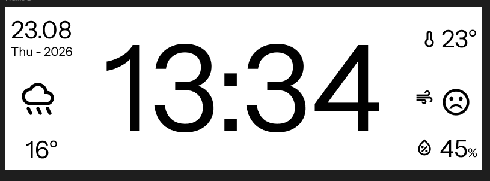
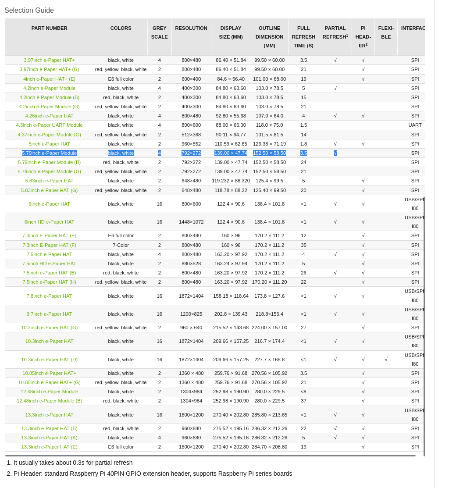
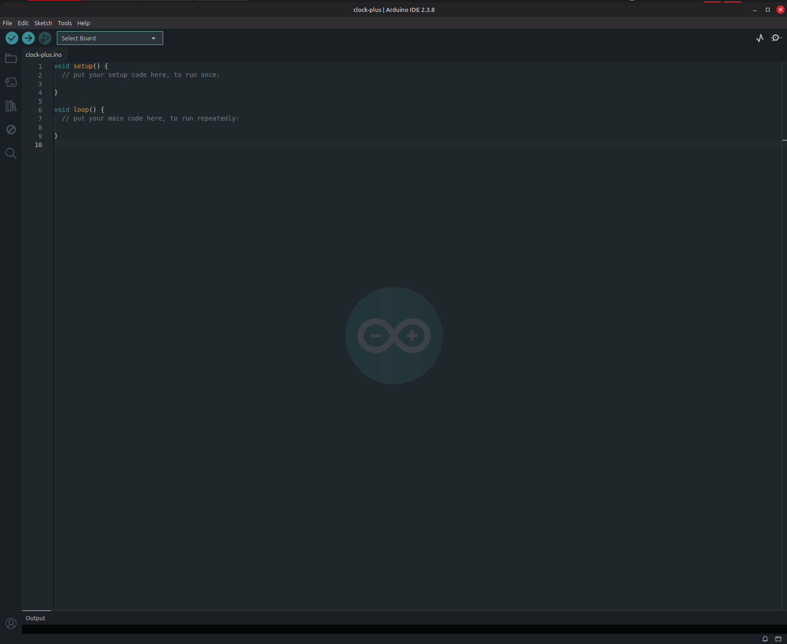
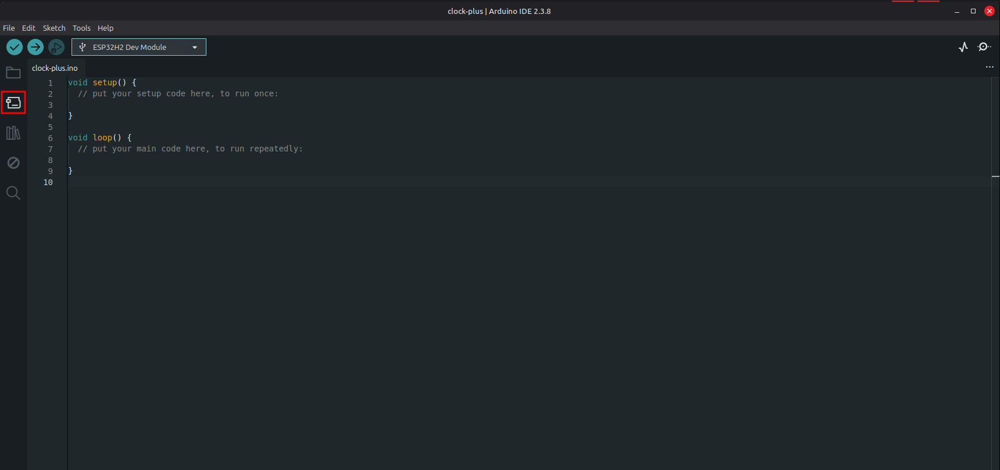
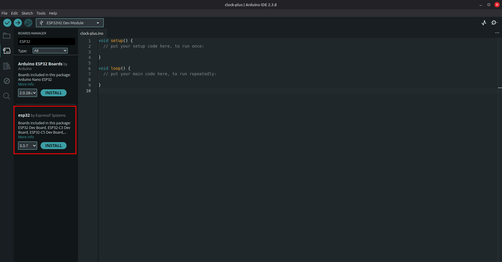
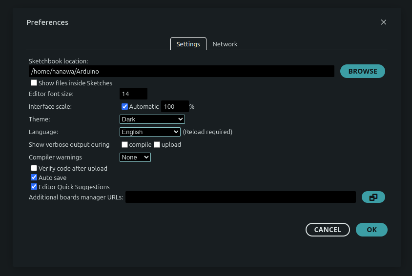
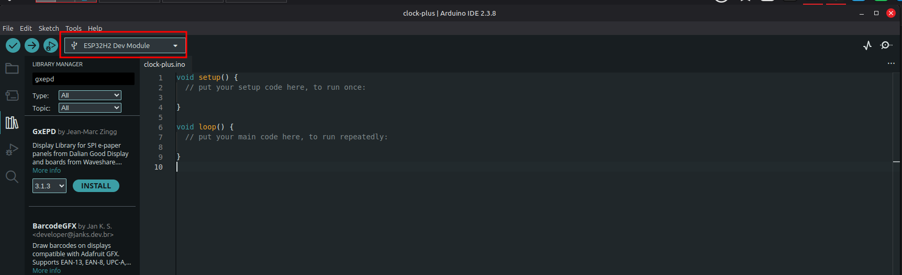
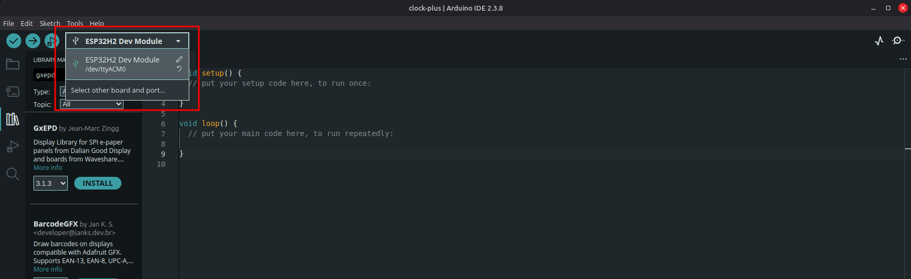
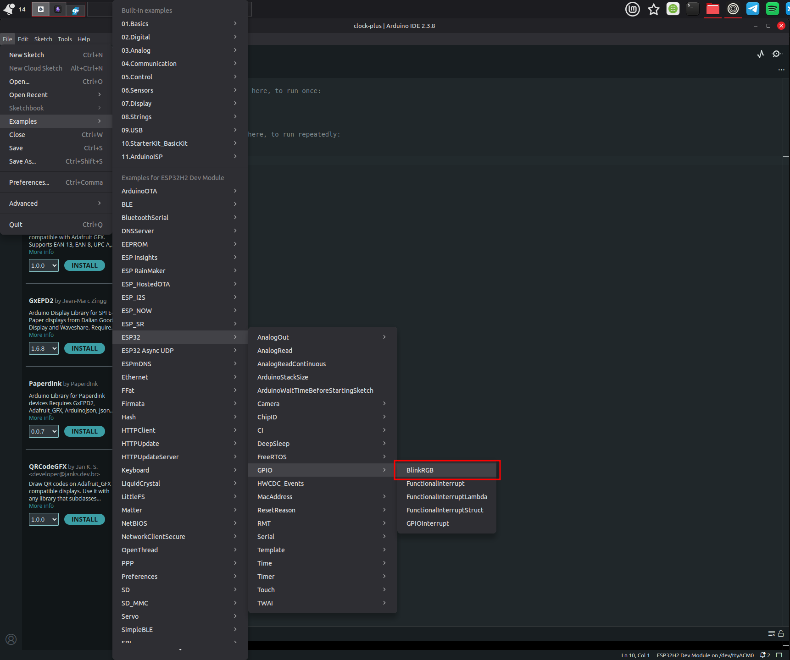
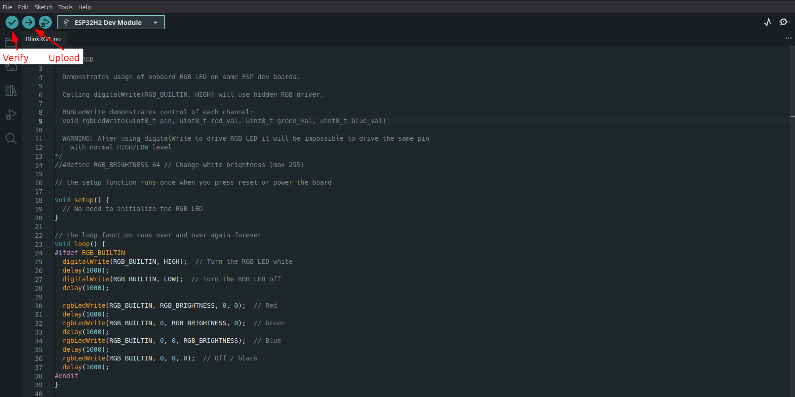

# Clock Plus (Part 1)

## What is this project about

The goal is to make a zigbee device that works both as a low power clock, and a environmental sensor.

The project will be divided in a few parts:
1. Intro + Zigbee connection (you're here)
2. Connecting the e-Paper module display
3. Integrating the Environmental Sensor

My main reasons for doing this projects are:
- having a visible and accurate clock all over the house, working from home, it's nice to know how long you have until your meeting without having your phone with you the whole time
- our current clock/sensors are not connected to our zigbee/wife network, so it get's out of sync after a few days/months and whenever daylight saving time starts or ends
- Our current clock display starts fading when the battery is starting to get low, so a mix of zigbee (low power) and e-paper display makes it very efficient
- having a sensor as part of a clock display avoids having sensor devices visible
- I wanted to start doing electronic projects again after 10+ years, so this seemed like a good starter

Here is what we want to be displayed at the end.

This is the list of the components for the device
- ESP32-H2 Mini Development Board
	- **link**: https://www.waveshare.com/esp32-h2-zero.htm?sku=32260
	- **price**: 3,82 €
- BME68X Environmental Sensor
	- **link**: https://www.waveshare.com/bme68x-environmental-sensor.htm?sku=24245
	- price: 10,99 €
- 5.79inch e-Paper display Module
	- **link**: https://www.waveshare.com/5.79inch-e-paper-module.htm
	- **price**: 27,99 €
	- note: you can get other models, but if you use it for something that requires frequent refresh (like a clock), make sure it has partial refresh to optimize it and the full refresh time matches your needs. The one I got has partial refresh and the full refresh time takes 3.5 seconds.
	- 

You will also need:
- USB-C cable for flashing the program to the ESP32-H2 board
	- not all USB-C cables have data transfer! I spent a lot of time thinking nothing was working because the cable I was using was power only.
- Bread board for connecting the devices more easily
- wire cables to connect the devices that don't have pin to the bread board
- An active Zigbee gateway for you to connect to
- Understanding of C/C++

I did all my steps on a Linux Mint setup, so some of the steps may differ for Mac or Windows, also my goal is to see the Zigbee device connected to my home assistant so that's what I'll be covering here.

## Step 1 - Setting up Arduino IDE

Just as a side note, I also tried using esp-idf sdk on VS Code, but found it way more complicated than using the Arduino IDE, I'm sure that there may be some pros and cons to it, but on this guide I'm going to be covering only how to do it with the Arduino IDE.

- follow Arduino instructions to install the IDE for your operating system: https://support.arduino.cc/hc/en-us/articles/360019833020-Download-and-install-Arduino-IDE#installation-instructions
- Open Arduino IDE, you should see something like this 
- We need to add the board manager for ESP32-H2 on Arduino
	- open the **Boards Manager** 
		- search for **esp32**, those 2 options should appear:
			- Install the **esp32 by Espressif Systems** board 
	- go to **preferences**
		- `File -> Preferences` or `Ctrl+Comma` (on linux)
	- Add `https://espressif.github.io/arduino-esp32/package_esp32_dev_index.json` to Additional boards manager URLs 
		- click **ok**
	- If everything went well you should see `ESP32H2 Dev Module on the top left`
		- 

## Step 2 - Test Connection to the board

-  connect your ESP32-H2 to your computer using a **USB-C cable with data transfer**, this is really important since `power only` cables won't work.
	- if it went well you should be able to see the "port" bellow the board manager when expanding it 
- Let's use the `Blinky` example to test if it's really connected and you're able to flash the program to your board
	- Select **File -> Examples -> ESP32 (under "Examples for ESP32H2 Dev Module)  -> GPIO -> BlinkRGB** 
	- This should open a new window with the BlinkRGB.ino file/sketch 
	- We can now click to **upload** the code
		- If this was our own code, we would first **verify** to make sure the code can be compiled
		- 
	- If everything went well you should see the logs similar to those bellow on the **Output** tab and the your ESP32H2 rgb lights should be changing colors 🎉

## Step 3 - Basic connection to Zigbee

